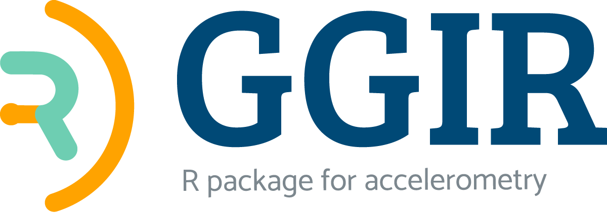

 

## Getting started:
The package [vignette](https://CRAN.R-project.org/package=GGIR/vignettes/GGIR.html) and [this](https://youtu.be/S8YPTrYNWdU) short tutorial video provide an introduction to GGIR, including: How it can be installed, Key software features, and where to get help.

## Contribution guidelines:
We always welcome contributions to the package.
If you want to contribute to the development of GGIR, have a look at the [contribution guidelines](CONTRIBUTING.md).

### Images usaged
The copyright of the GGIR logo as contained in the file vignettes/GGIR-MASTERLOGO-RGB.png lies with Accelting (Almere, The Netherlands), please contact v.vanhees@accelting.com to ask for permission to use this logo.

All other images in this repository are released under the Creative Commons Attribution 4.0 International (CC BY 4.0) license.

### Research notice

Please note that this repository is participating in a study into sustainability of open source projects. Data will be gathered about this repository for approximately the next 12 months, starting from June 2021.

Data collected will include number of contributors, number of PRs, time taken to close/merge these PRs, and issues closed.

For more information, please visit [the informational page](https://sustainable-open-science-and-software.github.io/) or download the [participant information sheet](https://sustainable-open-science-and-software.github.io/assets/PIS_sustainable_software.pdf).

